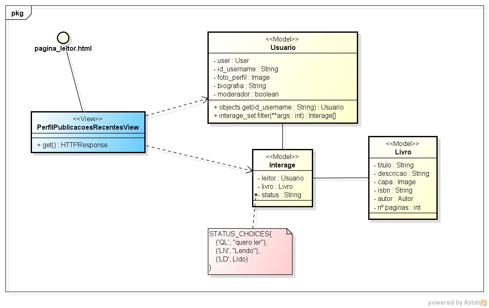

# CDU001. Gerenciar estante

- **Ator principal**: Leitor
- **Atores secundários**:
- **Resumo**: O leitor poderá gerenciar a sua estante.
- **Pré-condição**: Estar logado no sistema.
- **Pós-Condição**: A estante deve estar atualizada de acordo com as alterações do usuário.

## Fluxo Principal

&emsp; Ao acessar a aba "Minha estante" na página inicial, o leitor encontrará uma listagem dos livros que está lendo no momento

## Fluxo Alternativo I - Leitor quer abrir lista de livros do "desejo ler"

&emsp; O leitor seleciona o dropdown para a opção "desejo ler" e o sistema mostrará uma listagem de livros favoritados pelo usuário.

## Fluxo Alternativo II - Leitor quer abrir lista de livros do "livros concluídos"

&emsp; O leitor seleciona o dropdown para a opção "concluídos" e o sistema mostrará uma listagem de livros concluidos pelo usuário.

## Fluxo Alternativo III - Leitor deseja adicionar livro na estante

&emsp; O leitor clica em "adicionar livro" na listagem de preferência, e então o sistema mostra uma tela para pesquisar um livro, retornando uma listagem com todos os resultados, e apenas os livros que não estão relacionados ao usuário disponíveis para adição. E então, o usuário adiciona o livro selecionado a listagem que ele escolheu.

## Fluxo de Exceção

## Diagrama de Interação (Sequência ou Comunicação)

> Substituir pela imagem correspondente...

## Diagrama de Classes de Projeto

