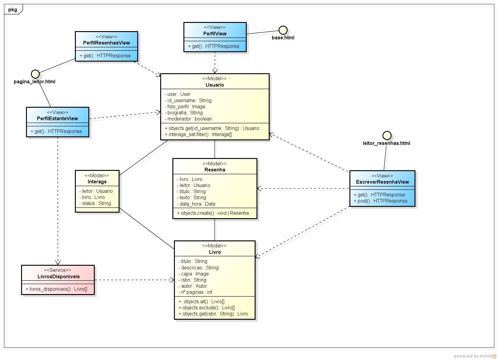

# CDU002. Ver postagens

- **Ator principal**: Leitor
- **Atores secundários**:	 
- **Resumo**: Leitor poderá ver as postagens de um leitor específico.
- **Pré-condição**: Estar autenticado no sistema.
- **Pós-Condição**: Leitor terá acesso a uma listagem de postagens de um leitor específico.

## Fluxo Principal
&emsp;&emsp;O leitor, após acessar o perfil do leitor que deseja ver as postagens, terá como opção a aba do perfil chamada "postagens". 
&emsp;&emsp;Após selecionar essa opção, o leitor terá acesso a uma listagem de postagens realizadas pelo leitor do perfil, contendo informações como, nome do leitor, username, foto, conteúdo da publicação, e a opção de curtir postagem.

## Fluxo de Exceção I - Não há postagens
&emsp;&emsp;Se o leitor do perfil acessado não tiver postagens publicadas, o sistema informará com um texto maior na aba de "postagens" que não há postagens publicadas por esse leitor.

> Obs. as seções a seguir apenas serão utilizadas na segunda unidade do PDSWeb (segundo orientações do gerente do projeto).

## Diagrama de Interação (Sequência ou Comunicação)

> Substituir pela imagem correspondente...

## Diagrama de Classes de Projeto

