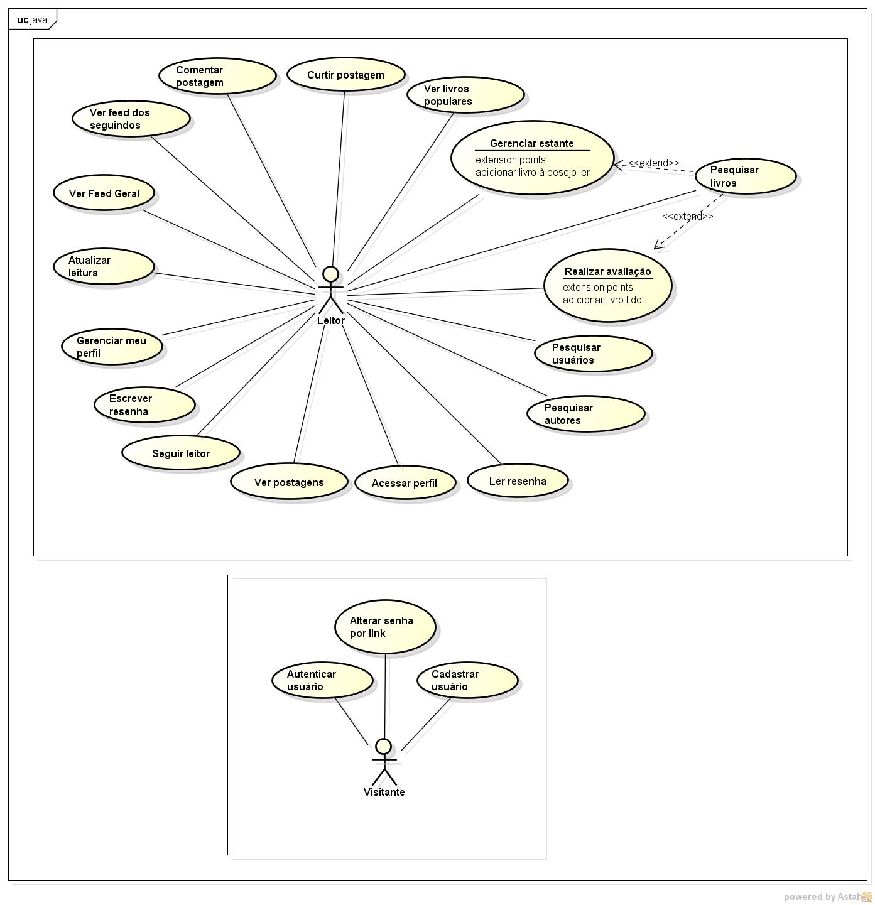

# Modelo de Casos de Uso

## 1. Diagrama de Casos de Uso

## 2. Listagem dos detalhamentos dos casos de uso

01. [CDU-001 - Gerenciar estante](cdu-001-gerenciar-estante/detalhamento-001.md) ✅
02. [CDU-002 - Atualizar leitura](cdu-002-atualizar-leitura/detalhamento-002.md) ✅
03. [CDU-003 - Ver feed geral](cdu-003-ver-feed-geral/detalhamento-003.md) ✅
04. [CDU-004 - Pesquisar livros](cdu-004-pesquisar-livros/detalhamento-004.md) ✅
05. [CDU-005 - Escrever resenha](cdu-005-escrever-resenha/detalhamento-005.md) 
06. [CDU-006 - Realizar avaliação](cdu-006-realizar-avalicao/detalhamento-006.md)
07. [CDU-007 - Ver livros populares](cdu-007-ver-livros-populares/detalhamento-007.md) ✅
08. [CDU-008 - Acessar perfil](cdu-008-acessar-perfil/detalhamento-008.md) 
09. [CDU-009 - Ver postagens](cdu-009-ver-postagens/detalhamento-009.md)
10. [CDU-010 - Ler resenha](cdu-010-ler-resenha/detalhamento-010.md) 
11. [CDU-011 - Pesquisar leitores](cdu-011-pesquisar-leitores/detalhamento-011.md)
12. [CDU-012 - Seguir leitor](cdu-012-seguir-leitor/detalhamento-012.md) 
13. [CDU-013 - Ver feed dos seguindo](cdu-013-ver-feed-dos-seguindo/detalhamento-013.md)
14. [CDU-014 - Curtir postagem](cdu-014-curtir-postagem/detalhamento-014.md) ✅
15. [CDU-015 - Comentar postagem](cdu-015-comentar-postagem/detalhamento-015.md)
16. [CDU-016 - Pesquisar autores](cdu-016-pesquisar-autores/detalhamento-016.md)
17. [CDU-017 - Gerenciar meu perfil](cdu-017-gerenciar-meu-perfil/detalhamento-017.md) 
18. [CDU-018 - Autenticar usuário](cdu-018-autenticar-usuario/detalhamento-018.md) ✅
19. [CDU-019 - Cadastrar usuário](cdu-019-cadastrar-usuario/detalhamento-019.md) ✅
20. [CDU-020 - Alterar senha por link](cdu-020-alterar-senha-por-link/detalhamento-020.md)
