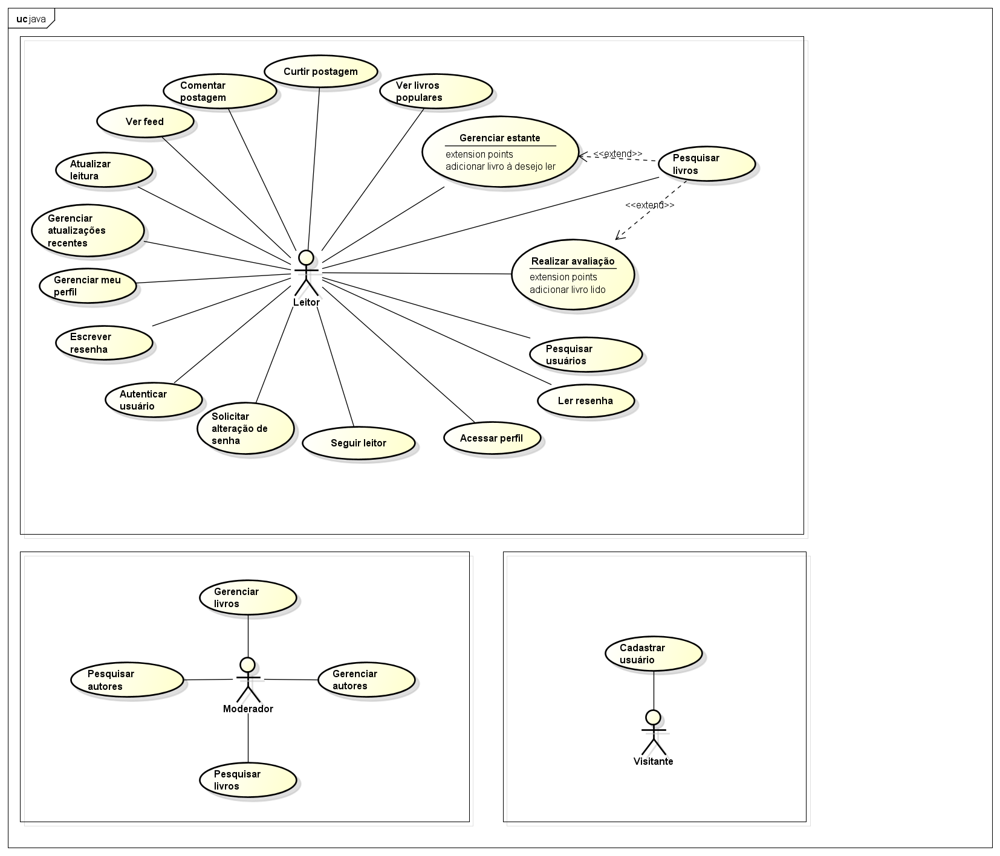

# Modelo de Casos de Uso

## 1. Diagrama de Casos de Uso

## 2. Listagem dos detalhamentos dos casos de uso

1. [CDU-001 - Gerenciar livros](cdu-001/detalhamento-001.md)
2. [CDU-002 - Gerenciar feed](cdu-002/detalhamento-002.md)
3. [CDU-003 - Gerenciar perfil](cdu-003/detalhamento-003.md)
4. [CDU-004 - Pesquisar](cdu-004/detalhamento-004.md)
5. [CDU-005 - Autenticar usuário](cdu-005/detalhamento-005.md)
6. [CDU-006 - Cadastrar usuário](cdu-006/detalhamento-006.md)
7. [CDU-007 - Solicitar Alteração de senha](cdu-007/detalhamento-007.md)
8. [CDU-008 - Seguir leitor](cdu-008/detalhamento-008.md)
9. [CDU-009 - Acessar perfil](cdu-009/detalhamento-009.md)
10. [CDU-010 - Ler resenha](cdu-010/detalhamento-010.md)
