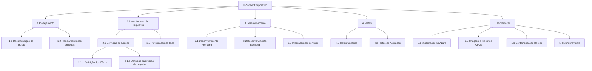

# 📋 Gerência de Projeto 

Aqui ficarão guardados os artefatos referentes ao gerenciamento do projeto.

## 👨‍💼 Registro das partes interessadas

| Cód. | Importância | Parte interessada | e-mail | Celular | Fone | Empresa | Função | Principais responsabilidades | Principais interesses / expectativas | Poder na empresa | Interesse no projeto | Estratégias para ganhar mais suporte ou reduzir resistências | Comentários |
|---|:---:|:---:|:---:|:---:|:---:|:---:|:---:|:---:|:---:|:---:|:---:|---:|---|
| 1 | 25 | Débora Samara | rodrigues.debora@escolar.ifrn.edu.br |  |  | IFRN | Desenvolvedor(a) | Desenvolvimento FullStack, levantamento de requisitos, implantação do sistema e UI/UX design | Ser aprovado(a) na matéria PDS Corporativo | 5-Muito Alto | 5-Muito Alto | (Gerenciar com atenção) | - |
| 2 | 25 | Ester Oliveira | ester.oliveira@escolar.ifrn.edu.br |  |  | IFRN | Desenvolvedor(a) | Desenvolvimento FullStack, levantamento de requisitos, implantação do sistema e UI/UX design | Ser aprovado(a) na matéria PDS Corporativo | 5-Muito Alto | 5-Muito Alto | (Gerenciar com atenção) | - |
| 3 | 25 | Felipe Alves | f.vasconcelos@escolar.ifrn.edu.br |  |  | IFRN | Desenvolvedor(a) | Desenvolvimento FullStack, levantamento de requisitos e implantação do sistema | Ser aprovado(a) na matéria PDS Corporativo | 5-Muito Alto | 5-Muito Alto | (Gerenciar com atenção) | - |
| 4 | 25 | João Roberto | camboim.chaves@escolar.ifrn.edu.br |  |  | IFRN | Desenvolvedor(a) | Desenvolvimento FullStack, levantamento de requisitos e implantação do sistema | Ser aprovado(a) na matéria PDS Corporativo | 5-Muito Alto | 5-Muito Alto | (Gerenciar com atenção) | - |
| 5 | 16 | Gracon Lima | gracon.lima@ifrn.edu.br |  |  | IFRN | Orientador do projeto Pratiler | Acompanhar e avaliar o desenvolvimento do projeto e orientar nas tarefas | Garantir que o projeto seja finalizado com sucesso | 4-Alto | 4-Alto | (Gerenciar com atenção) | - |
| 6 | 6 | Marília Aranha | marilia.freire@ifrn.edu.br |  |  | IFRN | Orientador do PDS | Acompanhar e avaliar o desenvolvimento do projeto, com foco em testes de software | Avaliar as entregas referentes à materia que leciona (Teste de Software) | 3-Médio | 2-Baixo | (Monitorar - mínimo esforço) | - |
| 7 | 6 | Sales Filho | sales.filho@ifrn.edu.br |  |  | IFRN | Orientador do PDS | Acompanhar e avaliar o desenvolvimento do projeto, com foco em gerência de projetos | Avaliar as entregas referentes à materia que leciona (Gerencia de Projetos) | 3-Médio | 2-Baixo | (Monitorar - mínimo esforço) | - |
| 8 | 2 | Lívia Vitória (Projeto Gambiarra) |  |  |  | IFRN | Representante do Gambiarra | Não possuem responsabilidades no desenvolvimento do projeto | Acompanhar o desenvolvimento das tarefas do PDS e do projeto | 1-Muito baixo | 2-Baixo | (Monitorar - mínimo esforço) | - |
| 9 | 2 | Victor Passos (Projeto Tatuadouro) |  |  |  | IFRN | Representante do Tatuadouro | Não possuem responsabilidades no desenvolvimento do projeto | Acompanhar o desenvolvimento das tarefas do PDS e do projeto | 1-Muito baixo | 2-Baixo | (Monitorar - mínimo esforço) | - |
| 10 | 2 | Giovanna Barros (Projeto DAMA) |  |  |  | IFRN | Representante do Dama | Não possuem responsabilidades no desenvolvimento do projeto | Acompanhar o desenvolvimento das tarefas do PDS e do projeto | 1-Muito baixo | 2-Baixo | (Monitorar - mínimo esforço) | - |
| 11 | 2 | Yasmin Fernandes (Projeto Sisteminha) |  |  |  | IFRN | Representante do Sisteminha | Não possuem responsabilidades no desenvolvimento do projeto | Acompanhar o desenvolvimento das tarefas do PDS e do projeto | 1-Muito baixo | 2-Baixo | (Monitorar - mínimo esforço) | - |
| 12 | 3 | André Gustavo | andre.almeida@ifrn.edu.br |  |  | IFRN | Gerente dos repositórios GitHub dos PDS | Gerenciar o repositório GitHub do projeto Pratiler | Organizar o repositório dos projetos | 3-Médio | 1-Muito baixo | (Monitorar - mínimo esforço) | - |

## 📊 Planejamento do Escopo

### Objetivo S.M.A.R.T - Aumentar a porcentagem de leitores no Brasil para 50% nos próximos 5 anos através de incentivo e interação social entre leitores

### Declaração do Escopo

|||
|:-|:-|
| Escopo do produto e critérios de aceitação | Sistema para organizar e acompanhar o progresso em leituras. O produto será aceito quando o sistema estiver implantado na nuvem com um pipelines de CI/CD e tiverem sido criados os devidos testes e documentações para ele |
| Entregas do projeto | Sistema distribuído com Front-end integrado com o Back-end e banco de dados  Sistema disponível em máquinas virtuais que executam pipelines CI/CD  Testes unitários e de integração do sistema  Documento do projeto |
| Exclusões do projeto | Funcionalidade para acessar a leitura de livros no próprio sistema |
| Restrições  | Prazos para realizar entregas do projeto |
| Premissas  | Funcionalidade de seguir leitores a fim de acompanhar suas interações e leituras |

### Estrutura Analítica do Projeto (EAP)

### Dicionário da EAP

| Atividade | Descrição | Responsáveis | Critérios de Aceitação |
| - | - | - | - |
| Planejamento | Planejamento Semanal das atividades do projeto | Débora, Ester, Felipe, João Roberto | As sprints devem ser planejadas em documentação |
| Levantamento de Requisitos | Analisar continuamente as necessidades do projeto para criar novos requisitos | Débora, Ester, Felipe, João Roberto | Todos os requisitos e regras de negócio devem estar claras e estabelecidas |
| Desenvolvimento | Codificação e desenvolvimento das entregas das funcionalidades do sistema | Débora, Ester, Felipe, João Roberto | Todas as funcionalidades propostas do sistema devem estar implementadas e a aplicação pronta para produção |
| Testes unitários | Implementação e documentação dos testes unitários | Débora, Ester, Felipe, João Roberto | Testes criados de formas estratégicas |
| Implantação | Alocação do código do Pratiler em um servidor on-line para acesso público | João Roberto | O sistema deve estar acessível e operante através do endereço IP atribuído a máquina hospedada |
