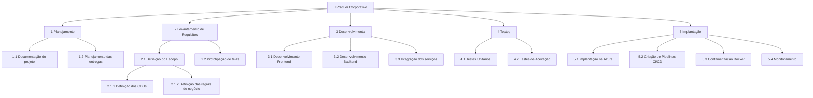

# 📋 Gerência de Projeto 

Aqui ficarão guardados os artefatos referentes ao gerenciamento do projeto.

## 👨‍💼 Registro das partes interessadas

## 📊 Planejamento do Escopo

### Objetivo S.M.A.R.T - Aumentar a porcentagem de leitores no Brasil para 50% nos próximos 5 anos através de incentivo e interação social entre leitores

### Declaração do Escopo

|||
|:-|:-|
| Escopo do produto e critérios de aceitação | Sistema para organizar e acompanhar o progresso em leituras. O produto será aceito quando o sistema estiver implantado na nuvem com um pipelines de CI/CD e tiverem sido criados os devidos testes e documentações para ele |
| Entregas do projeto | Sistema distribuído com Front-end integrado com o Back-end e banco de dados  Sistema disponível em máquinas virtuais que executam pipelines CI/CD  Testes unitários e de integração do sistema  Documento do projeto |
| Exclusões do projeto | Funcionalidade para acessar a leitura de livros no próprio sistema |
| Restrições  | Prazos para realizar entregas do projeto |
| Premissas  | Funcionalidade de seguir leitores a fim de acompanhar suas interações e leituras |

### Estrutura Analítica do Projeto (EAP)

### Dicionário da EAP

| Atividade | Descrição | Responsáveis | Critérios de Aceitação |
| - | - | - | - |
| Planejamento | Planejamento Semanal das atividades do projeto | Débora, Ester, Felipe, João Roberto | As sprints devem ser planejadas em documentação |
| Levantamento de Requisitos | Analisar continuamente as necessidades do projeto para criar novos requisitos | Débora, Ester, Felipe, João Roberto | Todos os requisitos e regras de negócio devem estar claras e estabelecidas |
| Desenvolvimento | Codificação e desenvolvimento das entregas das funcionalidades do sistema | Débora, Ester, Felipe, João Roberto | Todas as funcionalidades propostas do sistema devem estar implementadas e a aplicação pronta para produção |
| Testes unitários | Implementação e documentação dos testes unitários | Débora, Ester, Felipe, João Roberto | Testes criados de formas estratégicas |
| Implantação | Alocação do código do Pratiler em um servidor on-line para acesso público | João Roberto | O sistema deve estar acessível e operante através do endereço IP atribuído a máquina hospedada |
