# 📋 Gerência de Projeto 

Aqui ficarão guardados os artefatos referentes ao gerenciamento do projeto.

## 👨‍💼 Registro das partes interessadas

| Cód. | Importância | Parte interessada | e-mail | Celular | Fone | Empresa | Função | Principais responsabilidades | Principais interesses / expectativas | Poder na empresa | Interesse no projeto | Estratégias para ganhar mais suporte ou reduzir resistências | Comentários |
|---|:---:|:---:|:---:|:---:|:---:|:---:|:---:|:---:|:---:|:---:|:---:|---:|:---:|
| 1 | 25 | Débora Samara | rodrigues.debora@escolar.ifrn.edu.br |  |  | IFRN | Desenvolvedor(a) | Desenvolvimento FullStack, levantamento de requisitos, implantação do sistema e UI/UX design | Ser aprovado(a) na matéria PDS Corporativo | 5-Muito Alto | 5-Muito Alto | (Gerenciar com atenção) | - |
| 2 | 25 | Ester Oliveira | ester.oliveira@escolar.ifrn.edu.br |  |  | IFRN | Desenvolvedor(a) | Desenvolvimento FullStack, levantamento de requisitos, implantação do sistema e UI/UX design | Ser aprovado(a) na matéria PDS Corporativo | 5-Muito Alto | 5-Muito Alto | (Gerenciar com atenção) | - |
| 3 | 25 | Felipe Alves | f.vasconcelos@escolar.ifrn.edu.br |  |  | IFRN | Desenvolvedor(a) | Desenvolvimento FullStack, levantamento de requisitos e implantação do sistema | Ser aprovado(a) na matéria PDS Corporativo | 5-Muito Alto | 5-Muito Alto | (Gerenciar com atenção) | - |
| 4 | 25 | João Roberto | camboim.chaves@escolar.ifrn.edu.br |  |  | IFRN | Desenvolvedor(a) | Desenvolvimento FullStack, levantamento de requisitos e implantação do sistema | Ser aprovado(a) na matéria PDS Corporativo | 5-Muito Alto | 5-Muito Alto | (Gerenciar com atenção) | - |
| 5 | 16 | Gracon Lima | gracon.lima@ifrn.edu.br |  |  | IFRN | Orientador do projeto Pratiler | Acompanhar e avaliar o desenvolvimento do projeto e orientar nas tarefas | Garantir que o projeto seja finalizado com sucesso | 4-Alto | 4-Alto | (Gerenciar com atenção) | - |
| 6 | 6 | Marília Aranha | marilia.freire@ifrn.edu.br |  |  | IFRN | Orientador do PDS | Acompanhar e avaliar o desenvolvimento do projeto, com foco em testes de software | Avaliar as entregas referentes à materia que leciona (Teste de Software) | 3-Médio | 2-Baixo | (Monitorar - mínimo esforço) | - |
| 7 | 6 | Sales Filho | sales.filho@ifrn.edu.br |  |  | IFRN | Orientador do PDS | Acompanhar e avaliar o desenvolvimento do projeto, com foco em gerência de projetos | Avaliar as entregas referentes à materia que leciona (Gerencia de Projetos) | 3-Médio | 2-Baixo | (Monitorar - mínimo esforço) | - |
| 8 | 2 | Lívia Vitória (Projeto Gambiarra) |  |  |  | IFRN | Representante do Gambiarra | Não possuem responsabilidades no desenvolvimento do projeto | Acompanhar o desenvolvimento das tarefas do PDS e do projeto | 1-Muito baixo | 2-Baixo | (Monitorar - mínimo esforço) | - |
| 9 | 2 | Victor Passos (Projeto Tatuadouro) |  |  |  | IFRN | Representante do Tatuadouro | Não possuem responsabilidades no desenvolvimento do projeto | Acompanhar o desenvolvimento das tarefas do PDS e do projeto | 1-Muito baixo | 2-Baixo | (Monitorar - mínimo esforço) | - |
| 10 | 2 | Giovanna Barros (Projeto DAMA) |  |  |  | IFRN | Representante do Dama | Não possuem responsabilidades no desenvolvimento do projeto | Acompanhar o desenvolvimento das tarefas do PDS e do projeto | 1-Muito baixo | 2-Baixo | (Monitorar - mínimo esforço) | - |
| 11 | 2 | Yasmin Fernandes (Projeto Sisteminha) |  |  |  | IFRN | Representante do Sisteminha | Não possuem responsabilidades no desenvolvimento do projeto | Acompanhar o desenvolvimento das tarefas do PDS e do projeto | 1-Muito baixo | 2-Baixo | (Monitorar - mínimo esforço) | - |
| 12 | 3 | André Gustavo | andre.almeida@ifrn.edu.br |  |  | IFRN | Gerente dos repositórios GitHub dos PDS | Gerenciar o repositório GitHub do projeto Pratiler | Organizar o repositório dos projetos | 3-Médio | 1-Muito baixo | (Monitorar - mínimo esforço) | - |

## 📊 Planejamento do Escopo

### Objetivo S.M.A.R.T - Entregar um sistema de organização pessoal de leituras para gerar incentivo a leitura e interação social entre leitores até o final de agosto de 2025

### Declaração do Escopo

|||
|:-|:-|
| Escopo do produto e critérios de aceitação | Sistema para organizar e acompanhar o progresso em leituras. O produto será aceito quando o sistema estiver implantado na nuvem com um pipelines de CI/CD e tiverem sido criados os devidos testes e documentações para ele |
| Entregas do projeto | Sistema distribuído com Front-end integrado com o Back-end e banco de dados  Sistema disponível em máquinas virtuais que executam pipelines CI/CD  Testes unitários e de integração do sistema  Documento do projeto |
| Exclusões do projeto | Funcionalidade para acessar a leitura de livros no próprio sistema |
| Restrições  | Prazos para realizar entregas do projeto |
| Premissas  | Funcionalidade de seguir leitores a fim de acompanhar suas interações e leituras |

### Estrutura Analítica do Projeto (EAP)

```mermaid
graph TD
    A[📖PratiLer Corporativo] --> B[1 Documentação]
    A --> C[2 Sistema distribuído]
    A --> D[3 Testes]
    A --> E[4 Implantação]
    B --> B1[1.1 Levantamento de requisitos]
    B --> B2[1.2 Prototipagem de telas]
    B --> B3[1.3 Definição de casos de uso]
    B --> B4[1.4 Planejamento do projeto]
    B --> B5[1.5 Gerenciamento dos stakeholders]
    B --> B6[1.6 Cronograma de marcos]
    C --> C1[2.1 Back-end]
    C --> C2[2.2 Front-end]
    C --> C3[2.3 Banco de dados]
    D --> D1[3.1 Documentação dos casos de teste]
    D --> D2[3.2 Análise Heurística]
    D --> D3[3.3 Testes unitários]
    D --> D4[3.4 Testes automatizados]
    E --> E1[4.1 VMs]
    E --> E2[4.2 Pipelines CI/CD]
    E --> E3[4.3 Conteinerização]
```

### Dicionário da EAP

| Atividade | Descrição | Responsáveis | Critérios de Aceitação |
| - | - | - | - |
| Front-end | Atividades relacionadas ao desenvolvimento front-end do sistema | Felipe e Débora | Telas fieis ao protótipo e com funcionalidades integradas com o Back-end |
| Back-end | Atividades relacionadas ao desenvolvimento back-end do sistema | Felipe, Ester e João Roberto | Funcionalidades funcionando e enviando os dados para o banco de dados |
| Banco de Dados | Atividades relacionadas ao monitoramento do banco de dados | João Roberto, Felipe e Débora | Armazenamento dos dados funcionando normalmente |
| VMs  | Provisionar e configurar máquinas virtuais na plataforma Microsoft Azure | João Roberto | Sistemas Front-end e Back-end e banco de dados configurados nas máquinas |
| Pipelines CI/CD | Implementar e configurar pipelines de Integração Contínua e Entrega Contínua (CI/CD) | Ester e João Roberto | Pipelines funcionando para a integração contínua do sistema |
| Docker | “Containerizar” as aplicações utilizando Docker, criando imagens padronizadas e gerenciando containers | João Roberto e Felipe | Garantir que todos os ambientes sejam iguais para todos |
| Testes unitários | Desenvolvimento e execução de testes unitários para validar o comportamento individual de componentes e funções do sistema. | Débora | Passar em todos os testes para garantir a qualidade do software |
| Testes automatizados | Criação de scripts de teste, integração com pipelines CI/CD para garantir a qualidade do software  | Ester e João Roberto | Passar em todos os testes de maneira automática após qualquer alteração feita para garantir a qualidade do software |
| Análise heurística | Análise das telas do sistema Pratiler para melhorias futuras | Ester | Ter a documentação da análise |
| Documentação dos casos de testes | Escrita dos casos de teste necessários através de técnicas de testes | João Roberto e Débora | Documentação dos casos de testes que estejam conformes os testes implementados |
| Levantamento dos requisitos | Estudos para descobrir novas necessidades do sistema | João Roberto, Felipe, Ester e Débora | Todos os requisitos devem estar bem definidos e refinados |
| Casos de uso | Documentação dos casos de uso do sistema | João Roberto, Felipe, Ester e Débora | Casos de uso que estejam de acordo com o que foi implementado no sistema |
| Gerenciamento dos stakeholders | Gerenciamento das partes interessadas no projeto e os seus níveis de interesse e poder no projeto | Débora, Ester, Felipe e João Roberto | Tabela que represente as partes interessadas no projeto com suas descrições e níveis de interesse |
| Cronograma de marcos | Cronograma de atividades do projeto focadas em tempo esforço e duração real até a entrega do projeto | Débora, Ester, Felipe e João Roberto | Atividades devem estar organizadas dando uma perspectiva de tempo das entregas |
| Planejamento do projeto | Planejamento do projeto com o seu cronograma de entregas | Débora, Ester, Felipe e João Roberto | Documentação que represente o planejamento do projeto |
| Protótipos das telas | Protótipos das telas desenvolvidos na plataforma Figma | Ester e Débora | Telas que representem todos os casos de uso do projeto |
| Documento de riscos | Documento de riscos que o projeto possui | Ester e João Roberto | Documente que represente os riscos do projeto de forma realista |
