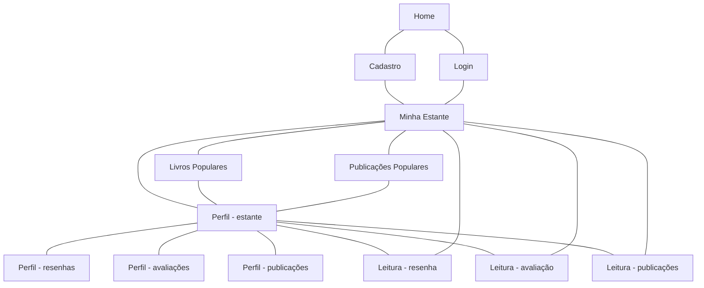

# Protótipos de Interface com o Usuário

## Mapa do Site

> Obs.: propõem-se a utilização de alguma ferramenta que possibilite a representação textual do diagrama. como o seguinte exemplo:

# Telas do visitante
## A. Tela 1: Home

## B. Tela 2: Login

## C. Tela 3: Cadastro

# Telas do perfil do usuário
## D. Tela 4: Meu perfil - estante

## E. Tela 5: Meu perfil - resenhas

## F. Tela 6: Meu perfil - avaliações

## G. Tela 7: Meu perfil - publicações

# Telas da página principal
## H. Tela 8: Minha estante

## I. Tela 9: Livros populares

## J. Tela 10: Publicações populares

# Telas de detalhamento da leitura
## K. Tela 11: Leitura - resenha

## L. Tela 12: Leitura - avaliação

## M. Tela 13: Leitura - publicações

