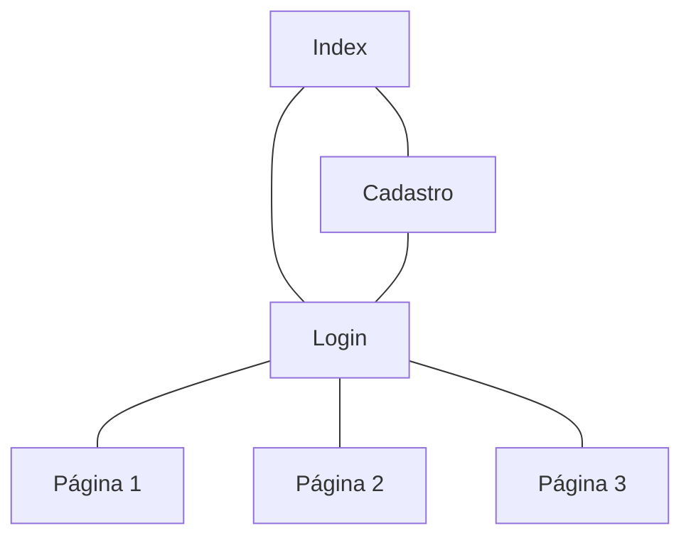

# Protótipos de Interface com o Usuário

## Mapa do Site

> Obs.: propõem-se a utilização de alguma ferramenta que possibilite a representação textual do diagrama. como o seguinte exemplo:

## A. Tela 1: Home

## B. Tela 2: Login

# Telas para o perfil do usuário
## C. Tela 3: Meu perfil - atualizações recentes

## D. Tela 4: Meu perfil - conquistas e desafios

## E. Tela 5: Meu perfil - listas de livros

## F. Tela 6: Meu perfil - lista de resenhas

## G. Tela 7: Meu perfil - resenha

# Telas para a página principal
## H. Tela 8: Desafios

## I. Tela 9: Minha estante

## J. Tela 10: Livros populares

## K. Tela 11: Seguindo

# Outras telas
## L. Tela 12: Informações de um livro

## M. Tela 13: Sobre nós

## N. Tela 14: Tela de cadastro

