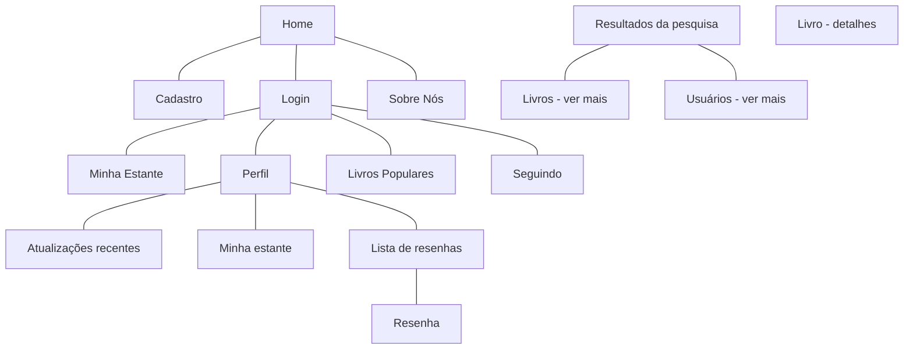
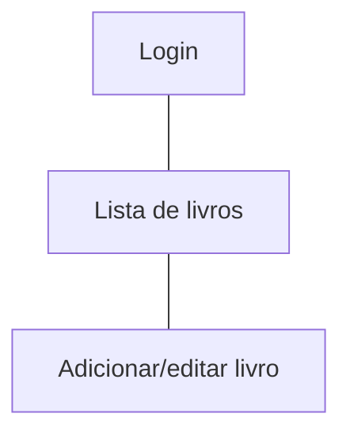
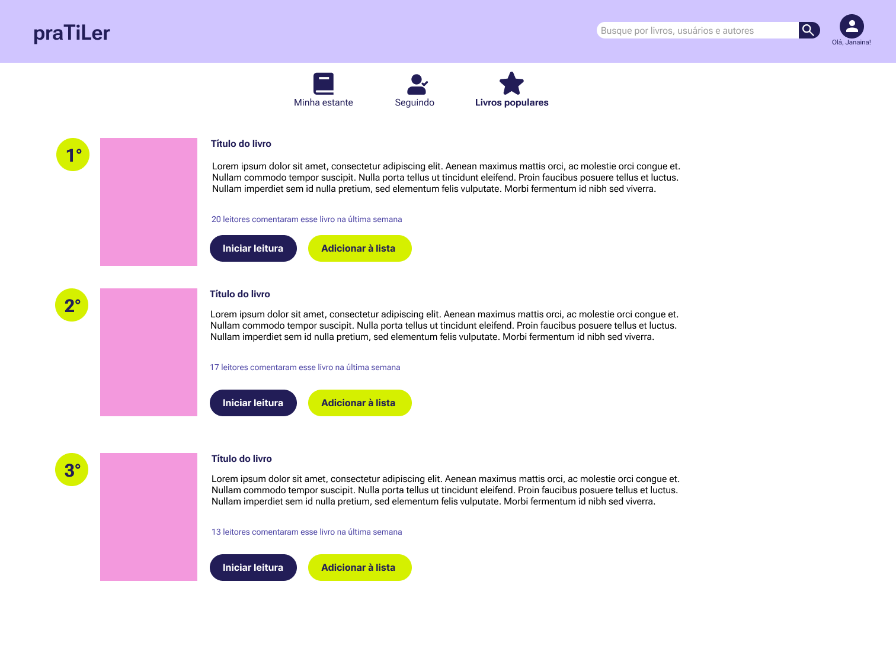
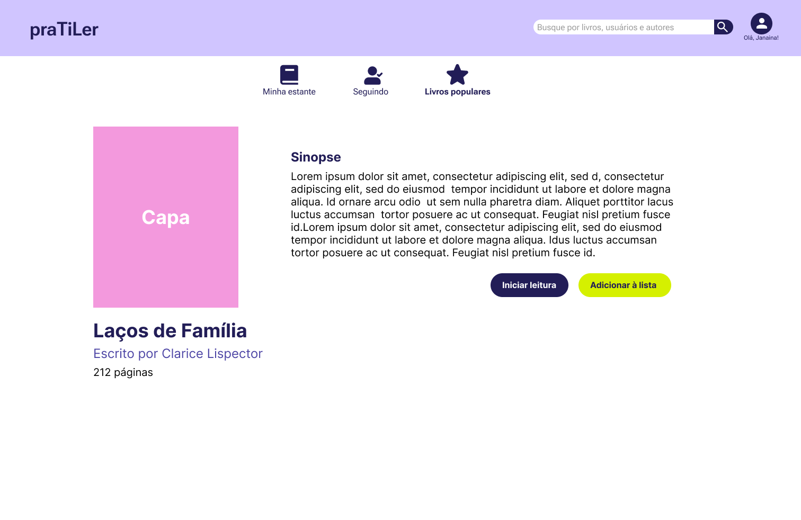
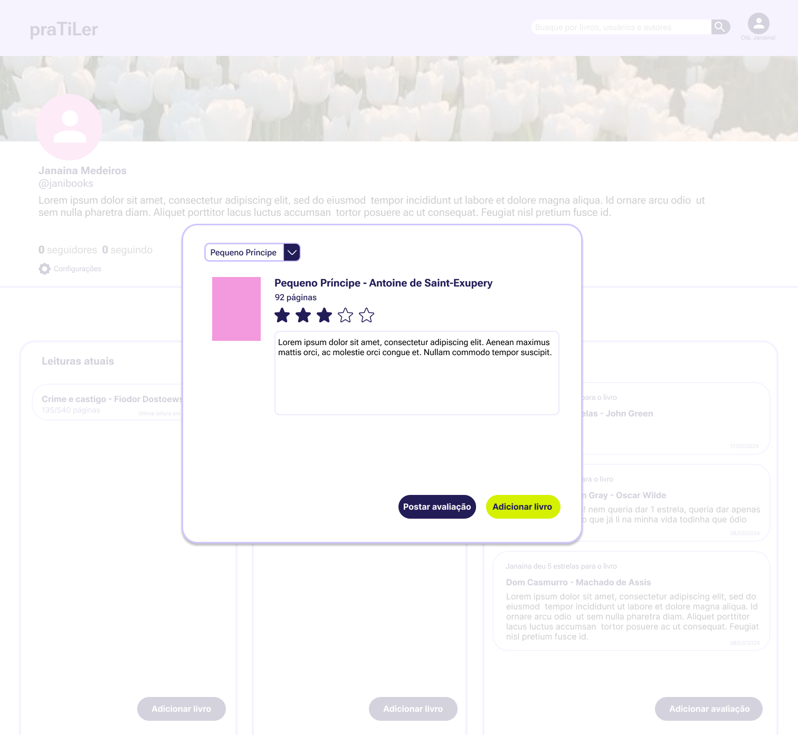
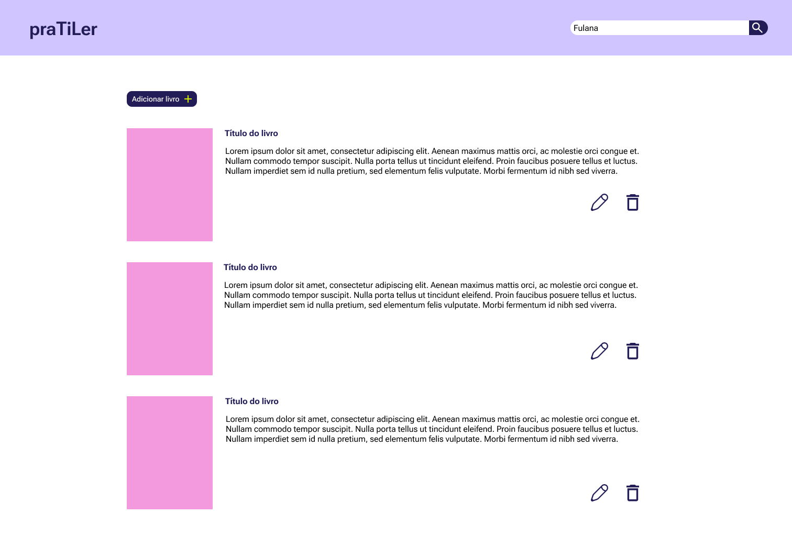

# Protótipos de Interface com o Usuário

## Mapa do Site

> Obs.: propõem-se a utilização de alguma ferramenta que possibilite a representação textual do diagrama. como o seguinte exemplo:

## A. Tela 1: Home

## B. Tela 2: Login e cadastro

# Telas para o perfil do usuário
## C. Tela 3: Meu perfil - atualizações recentes

## E. Tela 5: Meu perfil - listas de livros

## F. Tela 6: Meu perfil - lista de resenhas

## G. Tela 7: Meu perfil - resenha

# Telas para a página principal

## I. Tela 9: Minha estante

## J. Tela 10: Livros populares

## K. Tela 11: Seguindo

# Telas de pesquisa
## L. Tela 12: Pesquisando

## M. Tela 13: Ver mais da pesquisa - Livros

## N. Tela 14: Ver mais da pesquisa - Usuários

# Outras telas
## O. Tela 15: Informações de um livro

## P. Tela 16: Sobre nós

# Pop-ups de gerenciamento de livros
## Q. Tela 17: Adicionar livro para ler pela Estante

## R. Tela 18: Adicionar livro para ler pelo Perfil

## S. Tela 19: Adicionar avaliação de livro

## T. Tela 20: Interface do moderador

