# Protótipos de Interface com o Usuário

## Mapa do Site

> Obs.: propõem-se a utilização de alguma ferramenta que possibilite a representação textual do diagrama. como o seguinte exemplo:

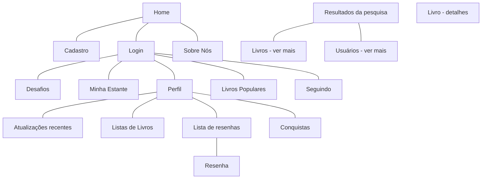

## A. Tela 1: Home
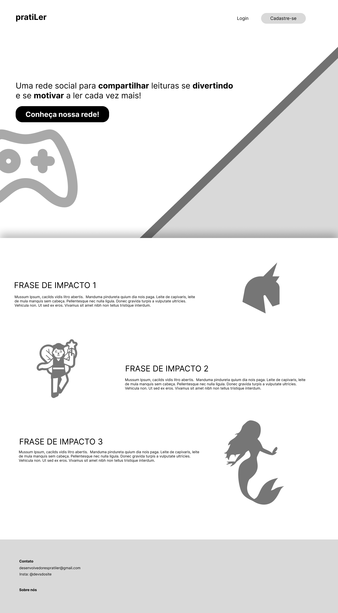

## B. Tela 2: Login e cadastro
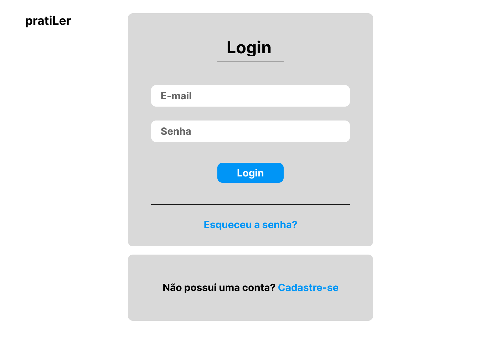
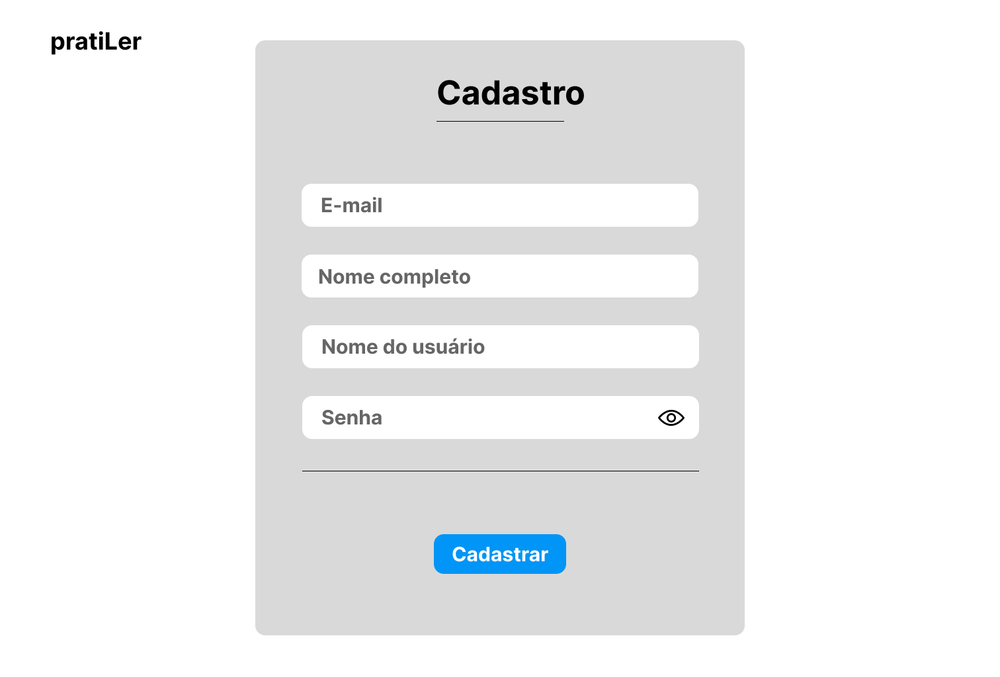

# Telas para o perfil do usuário
## C. Tela 3: Meu perfil - atualizações recentes

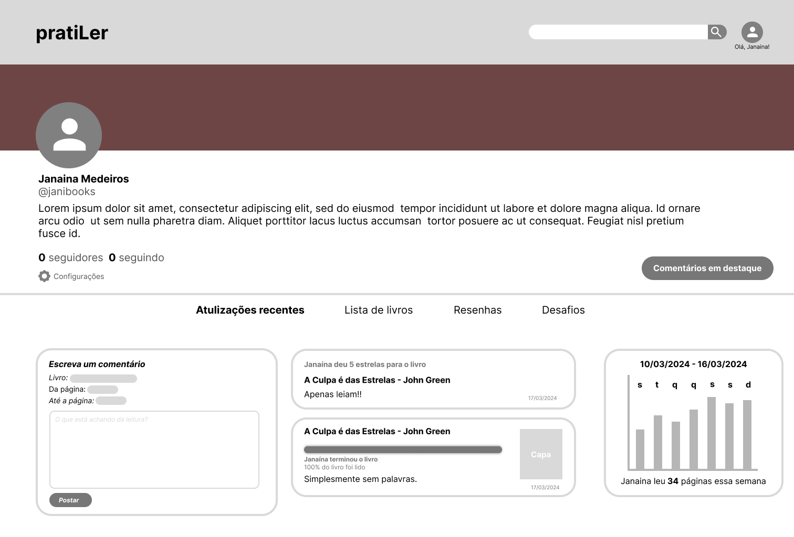

## D. Tela 4: Meu perfil - conquistas e desafios

## E. Tela 5: Meu perfil - listas de livros

## F. Tela 6: Meu perfil - lista de resenhas
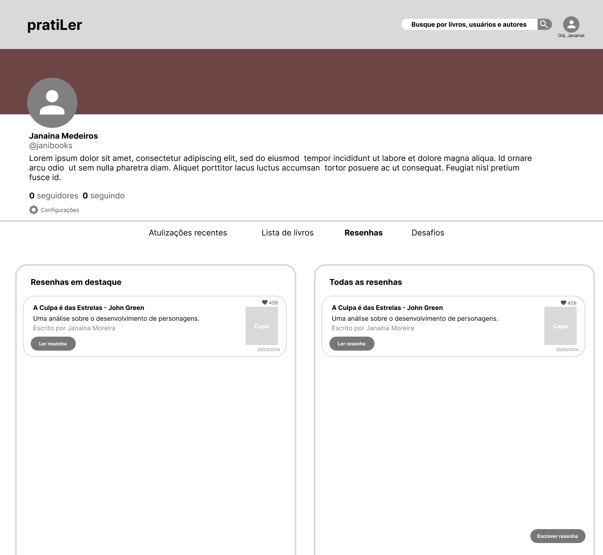

## G. Tela 7: Meu perfil - resenha

# Telas para a página principal
## H. Tela 8: Desafios
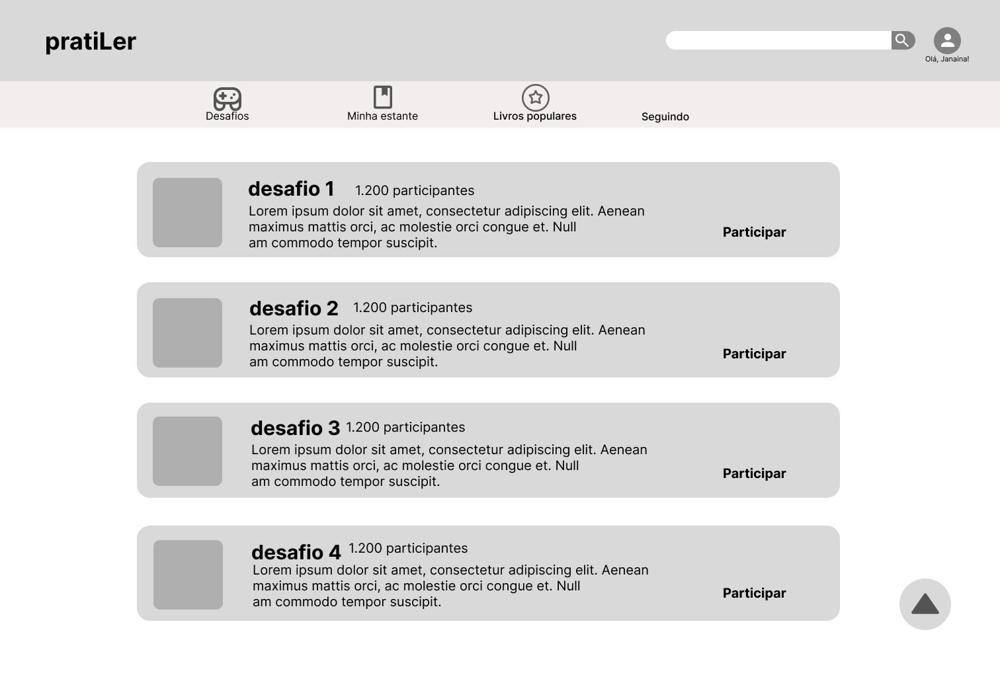

## I. Tela 9: Minha estante
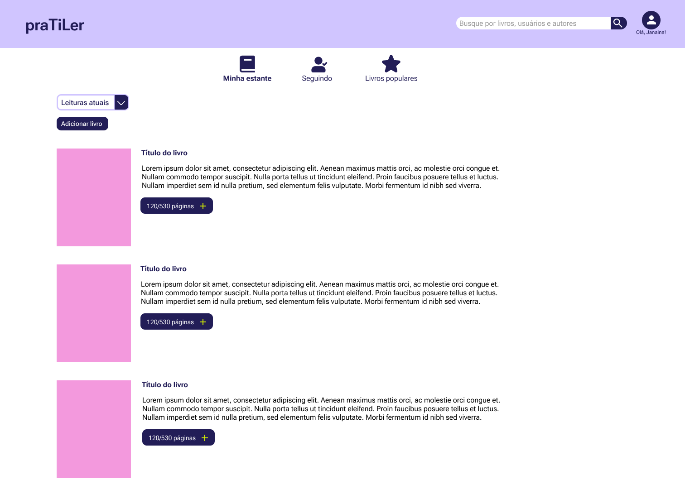

## J. Tela 10: Livros populares

## K. Tela 11: Seguindo
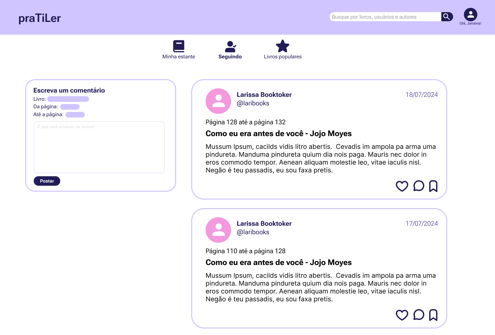

# Telas de pesquisa
## L. Tela 12: Pesquisando
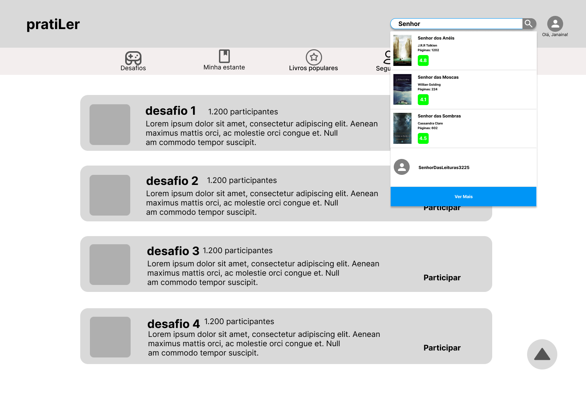

## M. Tela 13: Ver mais da pesquisa - Livros
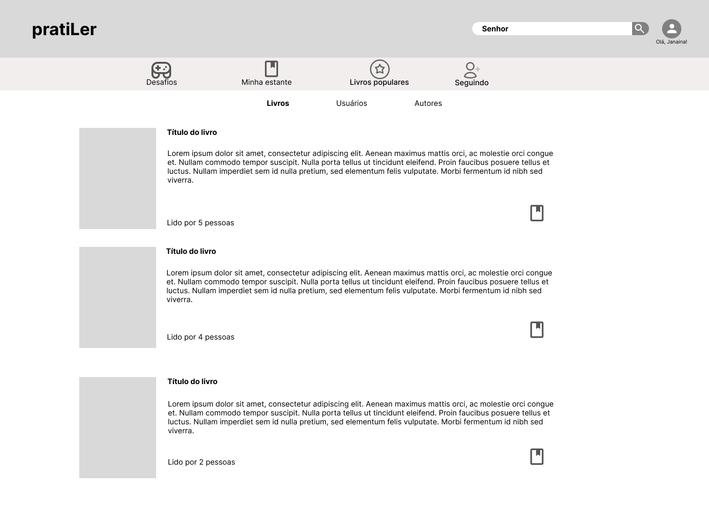

## N. Tela 14: Ver mais da pesquisa - Usuários
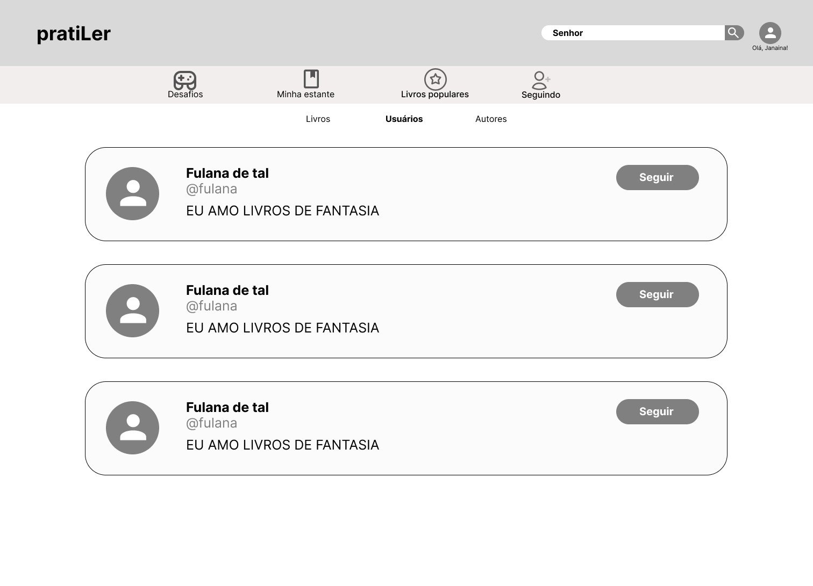

# Outras telas
## O. Tela 15: Informações de um livro

## P. Tela 16: Sobre nós

